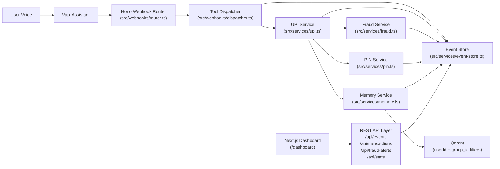

# VoicePay Assist

Voice-first payments assistant for accessible UPI interactions in Hindi, English, and Hinglish.

Built for the Vapi x Qdrant Hackathon (Bangalore, April 2026).

## What’s New (Finals Upgrade)

- Fraud velocity protection: blocks users after rapid consecutive transfers in a 5-minute window.
- PIN ownership flow: users set and change PIN with dedicated tools; no default hardcoded PIN fallback.
- PIN 2FA flow: `sendMoney` initiates transfer; `confirmSendMoney` completes it with a 4-digit PIN.
- High-value guardrail: high-value transfers require exact amount confirmation in the PIN step.
- Multi-tenant semantic memory: all Qdrant operations include `group_id` isolation.
- Event telemetry layer: in-memory event store tracks tool calls, fraud alerts, transactions, PIN checks, and memory operations.
- Ops dashboard: Next.js dark-themed monitoring UI for events, transactions, fraud, and stats.

## Problem

Over 285 million people in India are excluded from digital payments because current interfaces depend on reading, typing, and UI navigation. VoicePay Assist replaces screen complexity with voice-first interactions.

## Architecture



## Tools

| Tool | What it does |
|------|-------------|
| `setPin` | Sets a 4-digit PIN for a user account |
| `changePin` | Changes PIN using current PIN verification |
| `checkPinStatus` | Returns whether a user has configured a PIN |
| `checkBalance` | Returns the user’s current account balance |
| `sendMoney` | Initiates transfer and asks for 4-digit PIN confirmation |
| `confirmSendMoney` | Confirms pending transfer after PIN verification; includes amount confirmation for high-value transfers |
| `getTransactionHistory` | Lists recent sent and received transactions |
| `recallContext` | Semantic recall over user history (Qdrant) |

## Tech Stack

- Runtime: Node.js + TypeScript
- Backend: Hono
- Voice orchestration: Vapi
- Vector memory: Qdrant
- Validation: Zod
- Logging: Pino
- Dashboard: Next.js (App Router) + Tailwind + shadcn/ui + lucide-react
- Tests: Vitest

## Backend Setup

```bash
git clone https://github.com/ujjwalsai3007/Voice-Societal-Impact.git
cd Voice-Societal-Impact
npm install
cp .env.example .env
```

Environment values:

```bash
PORT=3000
QDRANT_URL=https://your-cluster.cloud.qdrant.io
QDRANT_API_KEY=your-qdrant-api-key
VAPI_SECRET=your-vapi-secret
DASHBOARD_ORIGIN=http://localhost:3001
```

Run backend:

```bash
npm run dev
```

Expose for Vapi:

```bash
cloudflared tunnel --url http://localhost:3000
```

## Dashboard Setup

```bash
cd dashboard
npm install
```

Create `dashboard/.env.local`:

```bash
NEXT_PUBLIC_API_BASE_URL=http://localhost:3000
```

Run dashboard (recommended on port 3001):

```bash
npm run dev -- --port 3001
```

## Vapi Dashboard Configuration (Manual)

1. Keep existing tools and webhook URL (`/webhook/vapi`).
2. Add/ensure these tools exist with exact parameters:
- `setPin`: `userId`, `pin`
- `changePin`: `userId`, `currentPin`, `newPin`
- `checkPinStatus`: `userId`
- `confirmSendMoney`: `senderId`, `pin`, `amountConfirmation` (optional for normal transfers, required for high-value)
3. Update prompt behavior:
- If PIN is missing, ask user to set PIN first and call `setPin`.
- After `sendMoney` returns PIN prompt text, ask user for PIN and call `confirmSendMoney`.
- For high-value transfers, include exact `amountConfirmation` in `confirmSendMoney`.
- If fraud block response appears, speak naturally:
  - “For your security, I’ve temporarily paused transactions. Please try again in a few minutes.”

## API Endpoints for Dashboard

- `GET /api/events?limit=N`
- `GET /api/transactions`
- `GET /api/fraud-alerts`
- `GET /api/stats`

`/api/stats` returns:

```json
{
  "totalTransactions": 0,
  "blockedCount": 0,
  "activeUsers": 0,
  "totalVolume": 0,
  "transferInitiatedCount": 0,
  "pinVerifiedCount": 0,
  "pinFailedCount": 0,
  "highValueChallengeCount": 0,
  "highValueConfirmedCount": 0
}
```

## Demo Script (Two Tabs)

1. Start backend (`localhost:3000`) and dashboard (`localhost:3001`).
2. Open dashboard on one screen/tab (`/`, `/events`, `/fraud`).
3. Start live Vapi call on another screen/tab.
4. Say: “Check my balance” -> watch tool/event log update.
5. Say: “Set my PIN to 1234” -> assistant confirms PIN setup.
6. Say: “Send 500 rupees to Ramesh” -> assistant asks for PIN.
7. Give wrong PIN once -> observe PIN failure event.
8. Give correct PIN -> transaction succeeds and stats update.
9. Say: “Send 2500 rupees to Ramesh” -> assistant asks for PIN + amount confirmation; complete transfer.
10. Repeat transfers quickly to trigger fraud block -> show `/fraud` page highlighting blocked attempts.

## Tests

Run backend tests:

```bash
npm test
```

Run dashboard lint/build:

```bash
cd dashboard
npm run lint
npm run build
```

## Project Structure

```text
src/
  index.ts
  services/
    upi.ts
    upi-tools.ts
    fraud.ts
    pin.ts
    event-store.ts
    memory.ts
    qdrant.ts
  webhooks/
    router.ts
    dispatcher.ts

dashboard/
  app/
    page.tsx
    events/page.tsx
    transactions/page.tsx
    fraud/page.tsx

tests/
  ...existing tests...
  fraud.test.ts
  pin.test.ts
```

## Live Demo

[Watch demo](https://drive.google.com/file/d/1_mjqds6lz4ZYDrsHsT9zEhmLdm0-48bl/view?usp=sharing)
