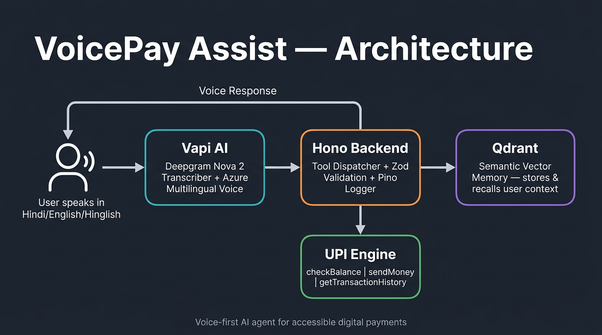

# VoicePay Assist

A voice-first AI agent for accessible digital payments in India. Users can check balances, send money, view transaction history, and recall past interactions — entirely through natural speech in Hindi, English, or Hinglish.

Built for the Vapi x Qdrant Hackathon (Bangalore, April 2026).

## Problem

Over 285 million people in India are excluded from digital payments because existing interfaces require reading, typing, and navigating complex screens. VoicePay Assist removes these barriers by replacing screens with voice.

## Architecture



**Vapi** handles voice — Deepgram Nova 2 for multilingual transcription, Azure for natural speech synthesis. When the user speaks, Vapi's AI decides which tool to call and sends a webhook to the backend.

**Hono backend** receives tool calls, validates parameters with Zod, dispatches them to the UPI engine, and returns results. Every request is logged with Pino for a full decision trail.

**Qdrant** provides semantic memory. Every transaction is stored as a vector embedding. When the user asks "what was my last payment?", Qdrant performs a vector search across their history and returns the most relevant context — no SQL, no keyword matching.

## Tools

| Tool | What it does |
|------|-------------|
| `checkBalance` | Returns the user's current account balance |
| `sendMoney` | Transfers money between users with confirmation |
| `getTransactionHistory` | Lists recent sent and received transactions |
| `recallContext` | Semantic search over past interactions via Qdrant |

## Tech Stack

- **Runtime**: Node.js with TypeScript
- **Server**: Hono (sub-300ms latency target)
- **Voice AI**: Vapi (Deepgram Nova 2 transcriber, Azure multilingual voice)
- **Vector DB**: Qdrant Cloud (semantic memory and context recall)
- **Validation**: Zod for all external inputs
- **Logging**: Pino (structured JSON logs)
- **Testing**: Vitest with strict TDD (16 test files, 140+ tests)

## Setup

```bash
git clone https://github.com/ujjwalsai3007/Voice-Societal-Impact.git
cd Voice-Societal-Impact
npm install
```

Copy the environment template and fill in your credentials:

```bash
cp .env.example .env
```

```
PORT=3000
QDRANT_URL=https://your-cluster.cloud.qdrant.io
QDRANT_API_KEY=your-qdrant-api-key
VAPI_SECRET=your-vapi-secret
```

Start the development server:

```bash
npm run dev
```

Expose it publicly (for Vapi webhooks):

```bash
cloudflared tunnel --url http://localhost:3000
```

Run the test suite:

```bash
npm test
```

## Project Structure

```
src/
  index.ts              # Server entry point
  lib/
    config.ts           # Environment variable loading
    logger.ts           # Pino structured logger
  services/
    upi.ts              # UPI transaction engine (balance, send, history)
    upi-tools.ts        # Tool handler registration
    qdrant.ts           # Qdrant client and collection management
    memory.ts           # Vector memory upsert and recall
    embedding.ts        # Text to vector embeddings
    cache.ts            # In-memory embedding cache
  webhooks/
    router.ts           # Vapi webhook router (parses tool-calls)
    dispatcher.ts       # Tool call dispatch and execution
    schemas.ts          # Zod schemas for Vapi payloads
    verify.ts           # Webhook authentication middleware
tests/                  # 16 test files covering all modules
```

## Vapi Configuration

1. Create an assistant on [dashboard.vapi.ai](https://dashboard.vapi.ai) with a multilingual system prompt
2. Set the transcriber to Deepgram Nova 2 with `multi` language
3. Set the voice to Azure multilingual
4. Create 4 custom tools (`checkBalance`, `sendMoney`, `getTransactionHistory`, `recallContext`) pointing to your tunnel URL + `/webhook/vapi`

## License

ISC
